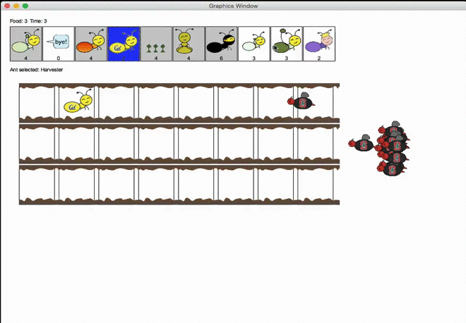

#Crosstown-Rivalry-Ants-V.S.-Bees
A tower defense game inspired by Plants V.S. Zombies

   

##Usage: 

```
python3 ants_gui.py [-h] [-f] [-w] [-i] [--food FOOD]

optional arguments:
  -h, --help    show this help message and exit
  -f, --full    loads a full layout and assault plan
  -w, --water   loads a full layout with water
  -i, --insane  loads a difficult assault plan
  --food FOOD   number of food to start with
```

## Features
* 10 types of ants: HarvesterAnt, FireAnt, ShortThrower, LongThrower, ThrowerAnt, ScubaThrower, HungryAnt, WallAnt, NinjaAnt, and Queen
* 3 types of places: Land, Water, and BushAnt